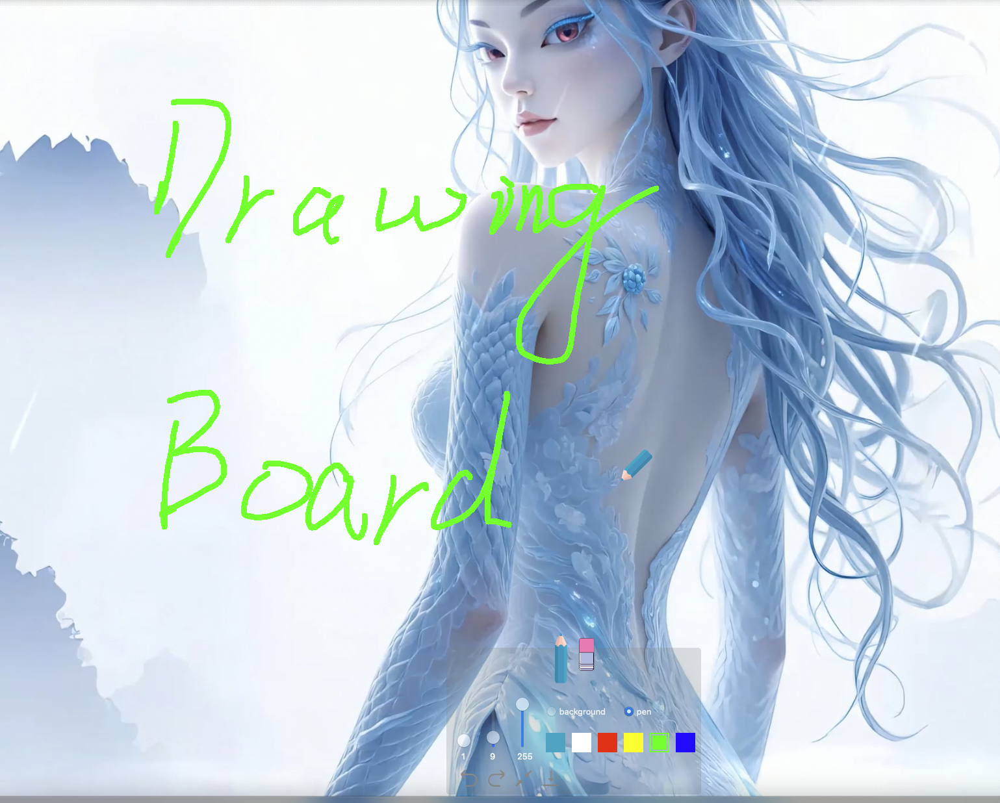

## Preview

<!--  -->


## Dependence

```shell
$ mkdir Third
$ cd Third
$ git clone https://github.com/DoYoungDo/QHotkey.git
```

## Build

```shell
# build
$ python Script/build.py --build-dir build --qt-prefix /Users/doyoung/Qt --qt-cmake-dir /Users/doyoung/Qt/6.5.3/macos/lib/cmake --type Release
# bundle
$ python Script/bundle.py --build-dir build --info Info.plist --icon assets/DrawingBoard.icns --qt-prefix /Users/doyoung/Qt --qt-version-subdir "6.5.3/macos" --short-version 1.2 --build-version 0.0.1

```

## Feature

- [x] 画笔透明度

- [x] 标示当前画笔和颜色

- [x] 切换画笔

- [x] 记忆修改参数

- [x] 保存当前画布

- [x] 背景透明度

- [x] 背景颜色

- [x] 显示画笔宽度

- [x] 显示画笔颜色

- [x] 清理画板

- [x] 全局快捷键

- [x] 撤销和反撤销

- [x] 折叠控制面板

- [x] 擦除

- [x] 设置

- [x] 国际化

- [ ] 保存背景图片，类似于截图


